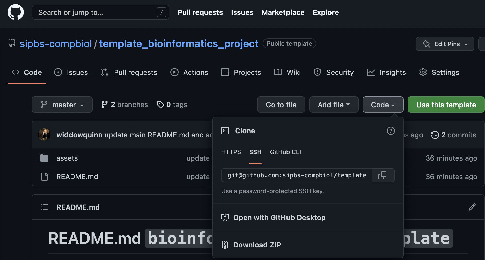

# README.md `bioinformatics_project_template`

This repository is a [GitHub template](https://docs.github.com/en/repositories/creating-and-managing-repositories/creating-a-template-repository) intended to make it easier for undergraduate and postgraduate bioinformatics project students to get started with their own `git` and GitHub repositories.

> Most of the advice in this repository and template is based on that in the [ten great papers on this page](https://widdowquinn.github.io/ten_great_papers/), though they contain much more information and advice than can be included here.

<!-- TOC -->

- [README.md `bioinformatics_project_template`](#readmemd-bioinformatics_project_template)
  - [Why should you use this repository?](#why-should-you-use-this-repository)
  - [How to use this repository](#how-to-use-this-repository)
    - [Cloning the repository/template to your machine](#cloning-the-repositorytemplate-to-your-machine)
      - [Creating a new repository in your own from this template](#creating-a-new-repository-in-your-own-from-this-template)
  - [Repository layout](#repository-layout)
  - [How to improve this repository](#how-to-improve-this-repository)
  - [Useful resources](#useful-resources)
  - [LICENCE](#licence)

<!-- /TOC -->

## Why should you use this repository?

This template was written specifically with the following kinds of users in mind:

- people working on their first (or an early) bioinformatics or computational biology project
- anyone who would like some guidance setting up a computational project structure in line with good practice to keep files, code and data in order

If you are already very familiar with building your own project repositories with `git` and GitHub, or you have experience with good practice in this kind of project structure, this template may not be of as much use to you. But it might save some time if it aligns well with your preferred way of working.

## How to use this repository

This repository is a _template_. It does not contain any project information itself, but it does lay out a directory structure with a minimal skeleton of explanatory `README.md` files explaining the motivation behind each directory in the project structure.

These files can - and should - be modified for your own project. For example, **this `README.md` file is a landing page for the project, explaining what it is, why it exists, and how to use it.** Your project repository should replace this `README.md` file with information that performs the same task _for your project_.

The same applies to `README.md` files in the subdirectories under this _project root_ folder

### Cloning the repository/template to your machine

There are several ways to get this template onto your machine, so you can use it. You should use the method that suits the way you work 

1. The easiest method is to download this template as a `.zip` file and uncompress it on your computer. Using this approach, you do not need to use `git` (which can be intimidating)
    - > _If you do not use `git` to manage your project files, you will not benefit from the advantages it gives in terms of version control and replicability._
    - To download the template, [use this link](https://github.com/sipbs-compbiol/template_bioinformatics_project/archive/refs/heads/master.zip) or click on the `Code` button, then the `Download ZIP` link at the GitHub page (see image below)

2. To use `git` with your project, and this template, you will need to do these things
   1. Create a GitHub account (if you do not already have one)
   2. Create a new repository from this template in your GitHub account
   3. Clone your new repository to your local machine
   - > Use of `git` is beyond the scope of this `README.md` but some links are provided in the `Useful Resources` section, below.
   - > A short guide to creating a new repository and cloning it to your own machine is given in the sections below.

#### Creating a new repository in your own from this template

To create a new repository from this template at GitHub:

1. Log in to GitHub at [`https://github.com`](https://github.com)
2. Use your browser to navigate to the GitHub page for this repository: [https://github.com/sipbs-compbiol/template_bioinformatics_project](https://github.com/sipbs-compbiol/template_bioinformatics_project)
3. Click on the `Use This Template` button

4. Click on the `Owner` drop-down menu, and select the account you would like to own the new repository (this will most likely be your own account)
5. Type the name of the repository you want to create into the `Repository Name` field.
6. Add a short description of your repository (or your project) in the `Description` field.
7. Choose whether your repository should be `Public` (anyone can see or clone it), `Private` (only you and those you authorise can see or clone it), or `Internal` (this is probably not relevant to you, and can be ignored)
8. Click `Create Repository from Template`

This will create a new repository in your `GitHub` account, which should be visible from your account page. You can then clone this repository to your machine, or work with it in the browser.

The official guidance for creating a new repository can be found on GitHub at the link below.

- [Creating a new repository from a template](https://docs.github.com/en/repositories/creating-and-managing-repositories/creating-a-repository-from-a-template)

## Repository layout

This repository follows the guidance in [Noble, 2009](https://doi.org/10.1371/journal.pcbi.1000424) as a starting point. There are a few small changes with respect to that manuscript's example, but you are free to modify the folders and the files they contain, to suit your own purposes.

 paper")

## How to improve this repository

If there is a part of this repository you think could be improved, or you think there is something missing that could be included, please do make a suggestion on our [`Issues` page](https://github.com/sipbs-compbiol/template_bioinformatics_project/issues).

- [`bioinformatics_project_template` Issues Page](https://github.com/sipbs-compbiol/template_bioinformatics_project/issues)
- [How to suggest an improvement using the Issues Page](https://github.com/sipbs-compbiol/template_bioinformatics_project/wiki/How-to-suggest-an-improvement-using-the-Issues-page)

If you would like to make a direct contribution to improve this repository, please do submit a [pull request](https://github.com/sipbs-compbiol/template_bioinformatics_project/pulls). For guidance in submitting pull requests, please see the [`wiki` page](https://github.com/sipbs-compbiol/template_bioinformatics_project/wiki) associated with this repository.

- [`bioinformatics_project_template` Pull Request page](https://github.com/sipbs-compbiol/template_bioinformatics_project/pulls)
- [`bioinformatics_project_template` Wiki page](https://github.com/sipbs-compbiol/template_bioinformatics_project/wiki)

## Useful resources

- [Creating a new repository from a template](https://docs.github.com/en/repositories/creating-and-managing-repositories/creating-a-repository-from-a-template)
- [GitHub's guide to `README.md` files](https://docs.github.com/en/repositories/managing-your-repositorys-settings-and-features/customizing-your-repository/about-readmes)

- [Ten great papers for biologists starting out in computational biology](https://widdowquinn.github.io/ten_great_papers/)

- Noble, W. S. (2009). A quick guide to organizing computational biology projects. PLoS Computational Biology, 5(7), e1000424. [http://doi.org/10.1371/journal.pcbi.1000424](http://doi.org/10.1371/journal.pcbi.1000424)

## LICENCE

This repository is licensed under the Creative Commons Attribution-Sharealike 4.0 licence. Please see the [`LICENSE` file]([./LICENSE](https://github.com/sipbs-compbiol/template_bioinformatics_project/blob/master/LICENSE)) in this repository for further detail.
